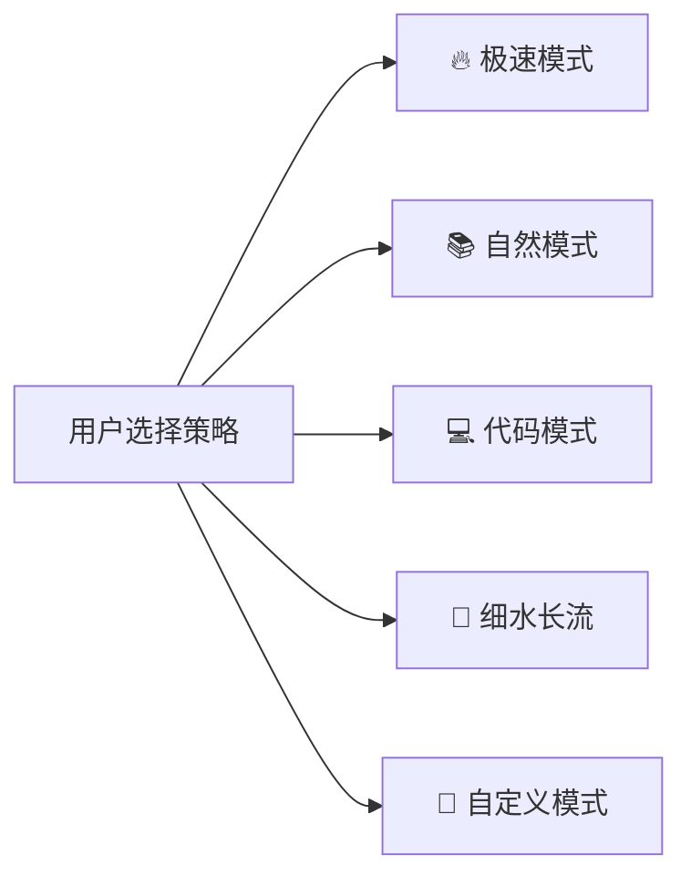
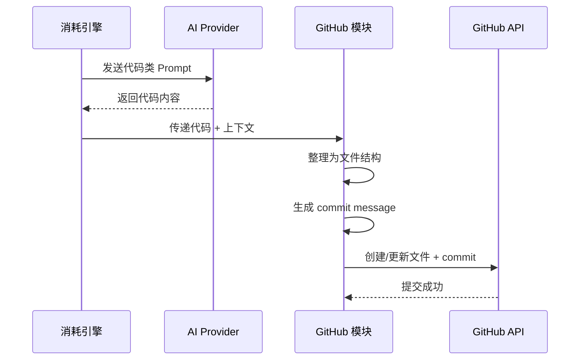
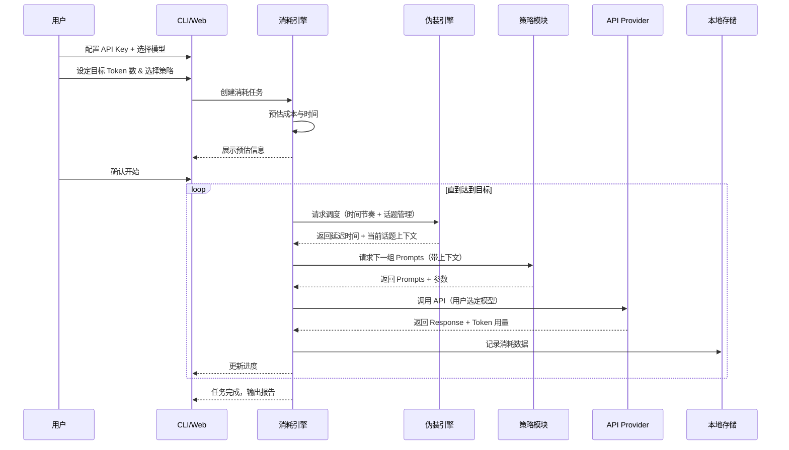

# Token Burner — AI Token 自动消耗工具

## 一、项目定位与背景

**痛点**：部分企业/团队用 Token 消耗量作为 AI 使用能力的评价指标，导致"用量焦虑"。

**定位**：一个开源 CLI + Web 双模式工具，用户设定目标 Token 数量，选择消耗策略后自动执行，帮助用户达到预期的 Token 使用量。

> [!CAUTION]
> **伦理与合规问题**：本项目本质是"刷量"工具，存在以下风险需提前考量：
> 1. **API 服务商 ToS**：OpenAI / Anthropic 等可能禁止无意义调用，有封号风险
> 2. **经济成本**：消耗 Token = 消耗真金白银，需要明确成本预估
> 3. **公司政策**：如公司付费账号刷量被发现，可能有职业风险
>
> **建议**：README 中应加明显免责声明，让用户自行承担风险。

---

## 二、需求方案

### 2.1 核心功能

| 功能 | 描述 | 优先级 |
|------|------|--------|
| 🎯 目标设定 | 用户指定要消耗的 Token 总量（如 100K、500K、1M） | P0 |
| 📊 策略选择 | 提供多种消耗速率/风格的方案（见 2.2） | P0 |
| ⚡ 自动执行 | 选定策略后自动调用 API 消耗 Token | P0 |
| 📈 进度追踪 | 实时显示已消耗 / 剩余 Token，预计完成时间 | P0 |
| 🤖 模型自选 | 列出 Provider 下所有可用模型 + 价格，用户自行选择 | P0 |
| 💰 成本估算 | 消耗前预估费用，消耗中实时显示花费 | P1 |
| 🔌 多平台支持 | 支持 OpenAI / Claude / Gemini 等主流 API | P1 |
| 🕐 定时任务 | 支持设定时间窗口执行（如仅工作日 9-18 点） | P2 |
| 📋 日志导出 | 导出消耗记录（CSV/JSON），展示调用详情 | P2 |
| 🐙 GitHub 集成 | 自动生成项目代码 + commit，模拟真实开发活动 | P2 |

### 2.2 消耗策略（核心差异化）



| 策略 | 原理 | Token 消耗效率 | 成本效率 | 自然度 |
|------|------|---------------|---------|--------|
| 🔥 极速模式 | 发送大段文本要求总结/翻译，最大化单次消耗 | ⭐⭐⭐⭐⭐ | ⭐⭐ | ⭐ |
| 📚 自然模式 | 模拟真实对话（多轮问答、变换主题、间隔随机） | ⭐⭐⭐ | ⭐⭐⭐ | ⭐⭐⭐⭐⭐ |
| 💻 代码模式 | 让 AI 写代码/做 Code Review，看起来像开发者 | ⭐⭐⭐⭐ | ⭐⭐⭐ | ⭐⭐⭐⭐ |
| 🐢 细水长流 | 低频率、小量级持续消耗，按天分散 | ⭐⭐ | ⭐⭐⭐⭐ | ⭐⭐⭐⭐⭐ |
| 🎨 自定义模式 | 用户自定义 Prompt 模板、频率、单次消耗量 | 自定义 | 自定义 | 自定义 |

### 2.3 已确认需求

- **API Key 管理**：用户自行配置，项目不提供代理
- **伪装度**：高伪装度，消耗内容需看起来像真实工作（详见 2.4）
- **模型选择**：用户自选模型（列出可用模型 + 价格，用户决定成本/性能平衡）
- **后期功能**：GitHub 集成，自动提交代码和 Commit（详见 2.5）

### 2.4 高伪装度系统设计（核心特性）

目标：让每一次 API 调用都看起来像**真实的开发工作**，经得起人工审查。

#### 伪装维度

| 维度 | 实现方式 |
|------|----------|
| **话题真实性** | 内置 200+ 真实开发场景 Prompt（React 状态管理、数据库优化、CI/CD 配置等） |
| **对话连贯性** | 单次任务内维持上下文，模拟多轮追问（如"这个方案有性能问题吗？" → "怎么优化？"） |
| **时间分布** | 模拟真人节奏：工作时间密集、午休暂停、偶尔加班，加入随机抖动 |
| **调用模式** | 避免机械化等间隔调用；模拟思考时间（30s-5min 随机间隔） |
| **话题切换** | 按项目/模块分组，一个话题持续 3-8 轮后自然切换 |

#### Prompt 模板库分类

```
prompts/
├── dev/                         # 开发类（最高伪装度）
│   ├── frontend.ts              # React/Vue 组件开发、状态管理、样式
│   ├── backend.ts               # API 设计、数据库查询、微服务
│   ├── devops.ts                # Docker、K8s、CI/CD、监控
│   ├── debugging.ts             # 错误排查、性能调优
│   └── code-review.ts           # 代码审查、重构建议
├── product/                     # 产品类
│   ├── requirements.ts          # 需求分析、PRD 撰写
│   ├── architecture.ts          # 系统架构设计
│   └── technical-writing.ts     # 技术文档、API 文档
├── learning/                    # 学习类
│   ├── concepts.ts              # 技术概念深入理解
│   ├── best-practices.ts        # 最佳实践咨询
│   └── comparison.ts            # 技术选型对比
└── context/                     # 上下文生成器
    ├── project-personas.ts      # 虚拟项目背景（电商/SaaS/社交等）
    └── conversation-chains.ts   # 多轮对话链模板
```

#### 伪装示例（自然模式下的一组对话链）

```
第1轮: "我在做一个电商项目的购物车模块，用 React + Redux，帮我设计状态结构"
第2轮: "这个结构下，添加商品到购物车的 action 和 reducer 怎么写？"
第3轮: "如果要支持优惠券叠加，状态结构需要怎么调整？"
第4轮: "写一下优惠券计算的单元测试"
  [间隔 15-30 分钟，模拟思考/编码]
第5轮: "购物车列表组件怎么做虚拟滚动优化？商品可能有几千个SKU"
  [切换话题]
第6轮: "另一个问题，项目的 Nginx 反向代理配置，如何做灰度发布？"
```

### 2.5 GitHub 集成（Phase 3 功能）

通过 GitHub API 自动生成**看起来像真实开发活动**的提交记录。

#### 功能设计

| 功能 | 描述 |
|------|------|
| 🔗 GitHub 授权 | OAuth 或 Personal Access Token 连接用户 GitHub 账号 |
| 📁 项目生成 | 根据 AI 对话内容，自动生成对应的代码文件（如聊了购物车就生成购物车代码） |
| 📝 智能 Commit | 生成语义化 commit message（feat/fix/refactor/docs 前缀） |
| 📅 提交分布 | 模拟真实开发节奏：每天 3-15 个 commits，工作日密集 |
| 🌿 分支管理 | 创建 feature 分支 → 多次 commit → merge 到 main，模拟 Git Flow |

#### 工作流程



#### 生成的 Repo 示例结构

```
auto-generated-ecommerce/
├── src/
│   ├── components/
│   │   ├── Cart.tsx              # 来自购物车话题的对话
│   │   └── ProductList.tsx       # 来自商品列表话题
│   ├── store/
│   │   ├── cartSlice.ts
│   │   └── store.ts
│   └── utils/
│       └── couponCalculator.ts   # 来自优惠券话题
├── tests/
│   └── couponCalculator.test.ts
├── README.md
└── package.json
```

---

## 三、技术执行方案

### 3.1 技术选型

| 层面 | 选型 | 理由 |
|------|------|------|
| **语言** | TypeScript (Node.js) | 类型安全、npm 生态丰富、易于开源推广 |
| **CLI 框架** | Commander.js + Inquirer.js | 成熟的命令行交互方案 |
| **Web 框架** | 可选：Next.js / Vite + React | 如需 Dashboard（P2阶段） |
| **API 调用** | OpenAI SDK / Anthropic SDK | 官方 SDK，稳定可靠 |
| **GitHub** | Octokit (GitHub SDK) | 官方推荐，功能完整 |
| **数据存储** | SQLite (better-sqlite3) | 本地轻量，无需部署数据库 |
| **进度展示** | cli-progress + chalk | CLI 下的进度条和彩色输出 |
| **定时调度** | node-cron | 定时任务支持 |

### 3.2 项目结构

```
token-burner/
├── src/
│   ├── cli/                    # CLI 入口与命令定义
│   │   ├── index.ts            # 入口
│   │   └── commands/           # 子命令（start, status, config, github...）
│   ├── core/                   # 核心业务逻辑
│   │   ├── engine.ts           # 消耗引擎（调度、计量、限速）
│   │   ├── estimator.ts        # 成本/时间估算器
│   │   ├── tracker.ts          # 进度追踪器
│   │   └── model-selector.ts   # 模型选择器（列出可用模型 + 价格）
│   ├── strategies/             # 消耗策略（可插拔）
│   │   ├── base.ts             # 策略基类/接口
│   │   ├── turbo.ts            # 极速模式
│   │   ├── natural.ts          # 自然模式
│   │   ├── code.ts             # 代码模式
│   │   ├── steady.ts           # 细水长流模式
│   │   └── custom.ts           # 自定义模式
│   ├── providers/              # API 提供商适配层
│   │   ├── base.ts             # 提供商接口
│   │   ├── openai.ts           # OpenAI 适配
│   │   ├── anthropic.ts        # Claude 适配
│   │   └── gemini.ts           # Gemini 适配
│   ├── prompts/                # Prompt 模板库（高伪装度）
│   │   ├── dev/                # 开发类 Prompt
│   │   ├── product/            # 产品类 Prompt
│   │   ├── learning/           # 学习类 Prompt
│   │   └── context/            # 上下文生成器（项目背景、对话链）
│   ├── github/                 # GitHub 集成模块（Phase 3）
│   │   ├── auth.ts             # GitHub 授权
│   │   ├── repo-manager.ts     # 仓库管理（创建、提交、分支）
│   │   ├── code-organizer.ts   # AI 输出 → 文件结构转换
│   │   └── commit-scheduler.ts # 提交节奏模拟
│   ├── camouflage/             # 伪装引擎
│   │   ├── time-pattern.ts     # 时间分布模拟（工作日/加班/午休）
│   │   ├── conversation-sim.ts # 多轮对话模拟器
│   │   └── topic-router.ts     # 话题路由与切换
│   ├── storage/                # 数据持久化
│   │   ├── db.ts               # SQLite 连接管理
│   │   └── models.ts           # 数据模型
│   ├── utils/                  # 工具函数
│   │   ├── token-counter.ts    # Token 计数器
│   │   ├── cost-calculator.ts  # 费用计算
│   │   └── logger.ts           # 日志
│   └── config/                 # 配置管理
│       ├── default.ts          # 默认配置
│       └── schema.ts           # 配置校验 Schema
├── tests/                      # 测试
├── docs/                       # 文档
├── package.json
├── tsconfig.json
└── README.md
```

### 3.3 核心流程



### 3.4 关键设计

#### 策略插件化
```typescript
interface BurnStrategy {
  name: string;
  description: string;
  estimateTokensPerCall(): number;
  generatePrompt(context: ConversationContext): PromptPayload; // 带上下文，维持对话连贯
  getDelay(): number;
  shouldContinue(consumed: number, target: number): boolean;
}
```

#### 多 Provider 适配 + 模型自选
```typescript
interface AIProvider {
  name: string;
  listModels(): Promise<ModelInfo[]>;   // 列出所有可用模型
  sendMessage(prompt: PromptPayload, model: string): Promise<ConsumeResult>;
  getTokenCount(text: string): number;
  getCostPerToken(model: string): { input: number; output: number };
}

// 模型选择交互：启动时展示可用模型列表
// ┌──────────────────────────────────────┐
// │ 选择模型:                            │
// │ ❯ gpt-4o          ($2.50/1M input)   │
// │   gpt-4o-mini     ($0.15/1M input)   │
// │   gpt-3.5-turbo   ($0.50/1M input)   │
// │   claude-3.5-sonnet($3.00/1M input)  │
// └──────────────────────────────────────┘
```

#### 伪装引擎
```typescript
interface CamouflageEngine {
  // 生成符合真人节奏的延迟时间
  getHumanLikeDelay(hour: number): number;
  // 判断当前时间是否在"工作时间"内
  isWorkingHour(): boolean;
  // 多轮对话上下文管理
  getConversationContext(): ConversationContext;
  // 决定是否该切换话题
  shouldSwitchTopic(roundCount: number): boolean;
}
```

### 3.5 开发路线图

| 阶段 | 内容 | 预计时间 |
|------|------|---------|
| **Phase 1 — MVP** | CLI 框架 + OpenAI 接入 + 模型自选 + 极速/自然策略 + 伪装引擎基础 + 进度条 | 3-4 天 |
| **Phase 2 — 完善** | 多 Provider + 全部策略 + 高伪装 Prompt 库 + 成本估算 + 日志导出 | 4-6 天 |
| **Phase 3 — GitHub** | GitHub 集成（授权、代码生成、智能 commit、提交节奏模拟） | 5-7 天 |
| **Phase 4 — 体验** | Web Dashboard + 定时任务 + 消耗报告可视化 | 5-7 天 |
| **Phase 5 — 社区** | 文档完善 + 策略/Prompt 市场（社区贡献）+ CI/CD | 持续 |

---

## 四、风险预判与规避

| 风险 | 影响 | 规避方案 |
|------|------|---------|
| API 限流 (Rate Limit) | 消耗中断 | 内置自动退避重试 + 伪装引擎控制合理节奏 |
| 账号被封 | 用户损失 | 高伪装度 + README 免责声明 |
| Token 计数不准 | 目标偏差 | 使用 tiktoken 精确计算 + API 返回值校准 |
| 费用失控 | 经济损失 | 模型自选控制成本 + 消耗前强制预估 + 费用上限自动停止 |
| 网络中断 | 任务中断 | 支持断点续传，进度持久化到 SQLite |
| GitHub Token 泄露 | 安全风险 | Token 仅存本地 + .gitignore 保护 + 最小权限 scope |

---

## 五、开源包装建议

- **项目名**：`token-burner` / `ai-token-forge` / `token-gym`（可讨论）
- **Slogan**：_"Burn tokens like a pro. 🔥"_
- **README 结构**：功能介绍 → 快速开始 → 策略说明 → 配置文档 → 免责声明
- **License**：MIT（最大化开源传播）
- **Star 策略**：发到 Hacker News / V2EX / 掘金 等社区，强调"讽刺性工具"定位

---

## 六、验证计划

### 自动化测试
- 策略模块单测：验证各策略生成的 Prompt 格式、Token 预估准确性
- 引擎单测：验证进度追踪、断点续传、费用上限停止等
- 伪装引擎测试：验证时间分布、话题切换逻辑
- Provider Mock 测试：模拟 API 响应验证消耗计量

```bash
npm test
npm run test:coverage
```

### 手动验证
1. `token-burner start --target 1000 --strategy natural --provider openai --dry-run`，验证 dry-run 模式下的伪装效果
2. 使用真实 API Key 小量测试（target=500），验证消耗量、伪装自然度和实际成本
